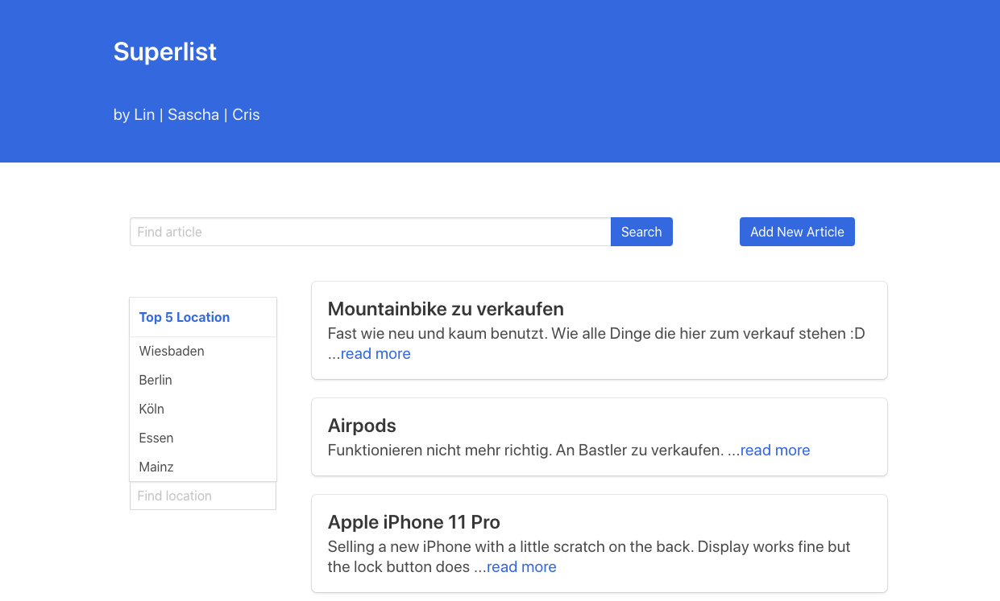

# Superlist

## Description

"Superlist" was a miniproject during an intense 3-months bootcamp on JavaScript. It showcases classified ads and allows users to add additional ones. 
In this miniproject the aim was to create a REST-API back-end server as well as a front-end client to serve it. 
The back-end server offers search functionalities and allows the add action. 
This mini project is a great base to learn REST and add much more functionalities. It is pre-configured to run on localhost, port 3000.



## Getting Started

The database table structure of classified ads is included in the following file, which also includes some initial entries:

```
structure.sql
```

### Dependencies

```
package.json
```

### Installing

```
npm install
```

### Starting the server

```
node api.js
```

### Starting the client

Open any browser and enter the url localhost:3000


## Authors

* Lin Xiang (Front-end implementation)
* Cristina Zenger (Layout)
* Sascha Zenger (Back-end server)
